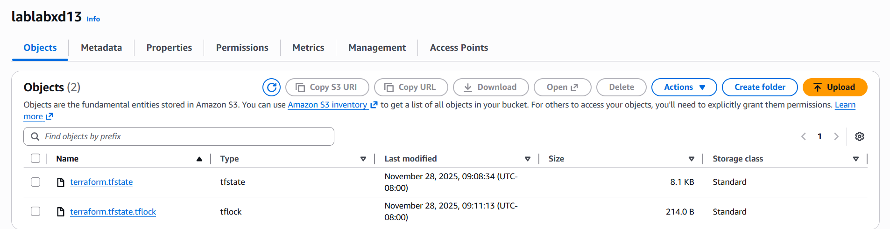
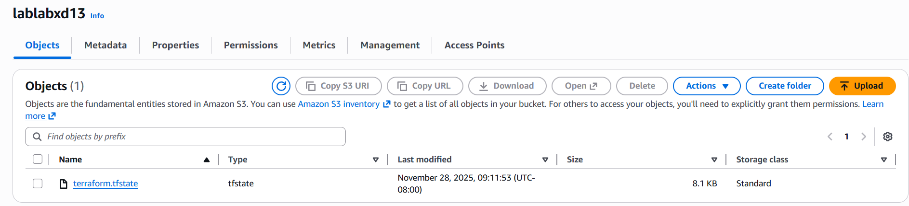

# Roger Hsieh + Kenneth Ng

## When is the state file created?
The file was created after the first time we ran terraform apply after configuring the backend. 

## When is the lock file present?
The lock file is present after a change to the config is made and terraform apply is run, but before confirming "yes". 

## Is the lock file always in the bucket after it is created?
No. The lock file disappeared after we confirmed that we want to apply the configuration by typing "yes". 

## lock-file.png

## state-file.png 

